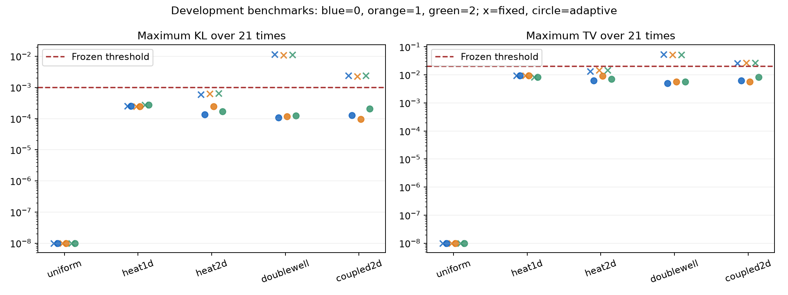

# FPE 工程验收记录

本报告汇总全部预先声明的种子，不把运行成功或小训练残差等同于科学结论。

低维自适应测试通过：**True**；保留审查批通过：**False**；共享预算上限的扩阶对照通过：**True**。
完整工程验收通过：**False**。连续模型的条件熵界、实测误差与未认证离散/统计误差分别记录。

## 全部低维案例

表中 KL、TV 和质量误差为 21 个预定时间点上的最大值；阈值分别为 0.001、0.02、0.0001。

| 模式 | 案例 | 种子 | 状态 | 最大 KL | 最大 TV | 质量误差 | 评价通过 |
|---|---|---:|---|---:|---:|---:|---|
| fixed | uniform | 0 | TRAINED | 0 | 0 | 1.11e-16 | True |
| fixed | uniform | 1 | TRAINED | 0 | 0 | 1.11e-16 | True |
| fixed | uniform | 2 | TRAINED | 0 | 0 | 1.11e-16 | True |
| fixed | heat1d | 0 | TRAINED | 0.000252493 | 0.00939411 | 1.17e-14 | True |
| fixed | heat1d | 1 | TRAINED | 0.00024638 | 0.00936832 | 1.2e-14 | True |
| fixed | heat1d | 2 | TRAINED | 0.000277284 | 0.00839078 | 9.77e-15 | True |
| fixed | heat2d | 0 | TRAINED | 0.000600597 | 0.0134153 | 1.41e-14 | True |
| fixed | heat2d | 1 | TRAINED | 0.00062358 | 0.0144815 | 1.8e-14 | True |
| fixed | heat2d | 2 | TRAINED | 0.000654815 | 0.0145182 | 1.35e-14 | True |
| fixed | doublewell | 0 | TRAINED | 0.0116009 | 0.0543845 | 4.04e-14 | False |
| fixed | doublewell | 1 | TRAINED | 0.010915 | 0.0522864 | 5.22e-14 | False |
| fixed | doublewell | 2 | TRAINED | 0.0110424 | 0.0528787 | 5.35e-14 | False |
| fixed | coupled2d | 0 | TRAINED | 0.00241093 | 0.0260991 | 1.27e-14 | False |
| fixed | coupled2d | 1 | TRAINED | 0.00229537 | 0.0270139 | 1.68e-14 | False |
| fixed | coupled2d | 2 | TRAINED | 0.00241659 | 0.0267694 | 1.28e-14 | False |
| adaptive | uniform | 0 | EMPIRICAL_TARGET_REACHED | 0 | 0 | 1.11e-16 | True |
| adaptive | uniform | 1 | EMPIRICAL_TARGET_REACHED | 0 | 0 | 1.11e-16 | True |
| adaptive | uniform | 2 | EMPIRICAL_TARGET_REACHED | 0 | 0 | 1.11e-16 | True |
| adaptive | heat1d | 0 | EMPIRICAL_TARGET_REACHED | 0.000252493 | 0.00939411 | 1.17e-14 | True |
| adaptive | heat1d | 1 | EMPIRICAL_TARGET_REACHED | 0.00024638 | 0.00936832 | 1.2e-14 | True |
| adaptive | heat1d | 2 | EMPIRICAL_TARGET_REACHED | 0.000277284 | 0.00839078 | 9.77e-15 | True |
| adaptive | heat2d | 0 | EMPIRICAL_TARGET_REACHED | 0.000133945 | 0.00627105 | 8.55e-15 | True |
| adaptive | heat2d | 1 | EMPIRICAL_TARGET_REACHED | 0.000243647 | 0.00901296 | 9.77e-15 | True |
| adaptive | heat2d | 2 | EMPIRICAL_TARGET_REACHED | 0.000167512 | 0.00701886 | 8.77e-15 | True |
| adaptive | doublewell | 0 | EMPIRICAL_TARGET_REACHED | 0.000106309 | 0.00496781 | 5.22e-14 | True |
| adaptive | doublewell | 1 | EMPIRICAL_TARGET_REACHED | 0.000117026 | 0.005771 | 5.33e-14 | True |
| adaptive | doublewell | 2 | EMPIRICAL_TARGET_REACHED | 0.000125035 | 0.00572045 | 5.48e-14 | True |
| adaptive | coupled2d | 0 | EMPIRICAL_TARGET_REACHED | 0.000126048 | 0.00635177 | 1.18e-14 | True |
| adaptive | coupled2d | 1 | EMPIRICAL_TARGET_REACHED | 9.63066e-05 | 0.00567245 | 1.27e-14 | True |
| adaptive | coupled2d | 2 | EMPIRICAL_TARGET_REACHED | 0.000209775 | 0.00835829 | 1.18e-14 | True |

图中仅为五个开发基准；零误差为便于对数显示置于 1e-8，表格保留真实数值。保留审查批见下表。

## 预声明扩阶对照

两组共享 120 秒总预算上限，训练、编译、候选探索和验证均计入；各自的实际耗时同时报告。参考评价在模型冻结后执行。固定组保留 K=2，最多 12 个各 500 更新的块，复用编译和优化器。

| 种子 | 自适应最终 KL | 固定 K=2 最终 KL | 自适应秒数 | 固定秒数 | 预算合规 |
|---:|---:|---:|---:|---:|---|
| 0 | 0.000949899 | 0.025009 | 54.87 | 46.94 | True |
| 1 | 0.000940349 | 0.0250229 | 47.69 | 45.05 | True |
| 2 | 0.000932664 | 0.0251152 | 53.05 | 48.52 | True |

KL 中位数降低比例：96.24%。验收要求至少 30%，并至少两个种子改善。

## 独立审查与压力测试

| 任务 | 状态 | 评价通过 | 最大 KL | 最大 TV |
|---|---|---|---:|---:|
| audit-0-s0 | EMPIRICAL_TARGET_REACHED | True | 5.75384e-06 | 0.00144333 |
| audit-0-s1 | EMPIRICAL_TARGET_REACHED | True | 6.26333e-06 | 0.00155175 |
| audit-0-s2 | EMPIRICAL_TARGET_REACHED | True | 6.24322e-06 | 0.00144237 |
| audit-1-s0 | EMPIRICAL_TARGET_REACHED | True | 8.09322e-05 | 0.00498068 |
| audit-1-s1 | PLATEAU | False | 0.00314443 | 0.0307699 |
| audit-1-s2 | EMPIRICAL_TARGET_REACHED | True | 0.000216174 | 0.00813405 |
| stress-coarse-small | NUMERICAL_FAILURE | False | — | — |
| stress-stress_barrier | BUDGET_EXHAUSTED | False | 0.0840755 | 0.168525 |
| stress-stress_frequency | PLATEAU | False | 0.0648421 | 0.159234 |

审查批：heat1d 幅度 0.27、相位 0.71；coupled2d 幅度 0.31、相位 1.17。若依据这些结果改算法，本批必须转为开发数据，重新生成审查批。压力例均未达到精度阈值：高势垒耗尽 12 轮上限，高频初值停在平台期，粗步长与小 batch 初始模型无法通过数值检查。它们分别明确退出，保留全部证据。

## 实测成本

目标为同一组 Fourier 观测量和势阱质量的绝对误差 0.01。这里不以 SDE 的观测量误差替代密度 KL 或 TV。

| 案例，seed=0 | 求解器训练与验证秒数 | 密度评价秒数 | 独立采样 2048 秒数 | 参考解秒数 | SDE 含细化秒数 | 达到同观测量精度 |
|---|---:|---:|---:|---:|---:|---|
| uniform | 9.398 | 0.153 | 0.007 | 0.000 | 4.340 | True |
| heat1d | 8.963 | 0.124 | 0.005 | 0.000 | 4.432 | True |
| heat2d | 100.397 | 2.875 | 0.029 | 0.002 | 12.028 | True |
| doublewell | 27.869 | 0.332 | 0.014 | 0.407 | 4.628 | True |
| coupled2d | 469.345 | 105.224 | 0.071 | 6.264 | 11.993 | True |

热方程参考为解析公式，势阱/耦合参考为有限体积加稀疏矩阵指数。表中参考成本包含细化；编译加首次执行的独立上界见各 evaluation.json，已包含于训练总时长，不重复相加。本轮低维 CPU 案例中，包含训练与验证的求解器总成本高于这些经典对照；快速重复采样不抵消首次训练成本。本轮不支持速度优势。

## 证据与边界

冻结规格 SHA-256：`584226cb3df139c509a1555f51ed5df7eeac390d4a1af9bbccb93de3a37ba815`。

- 固定基线复用的源码与逐元素等价证据：`baseline-reuse.json`。早期版本保存在 `acceptance-v1`，没有混入新规则的自适应三种子结果。
- 完整机器可读证据：`../runs/acceptance-v2/summary.json`，各实例 `state.json`、`evaluation.json`、逐候选检查点与收据。
- 源码外 wheel 入口验证：`delivery.json`。最终数学、恢复和运行时测试：`full-tests-final.txt`；早期记录 `full-tests-v2.txt` 继续保留。
- 控制器无法读取参考密度或离线 KL；评价阈值没有自动放宽。
- 条件熵界要求连续、光滑、正密度及精确总体积分。样本残差、网格细化和三倍配对标准误是工程证据，不是严格误差证书。
- 最终审查 `audit-1-s1` 超过冻结 KL/TV 阈值，见 [独立失效分析](heldout-failure-review.md)。15/15 开发基准通过不覆盖这次失败，完整工程验收未通过。
- 3072 维真实图像实验两种容量均未生成可辨认复杂图片，见 [图像工程报告](image-feasibility.md) 与 [独立证据核验](image-evidence-review.md)。
- 预定任务共 45 项；尚缺任务：[]；异常进程：{}。
